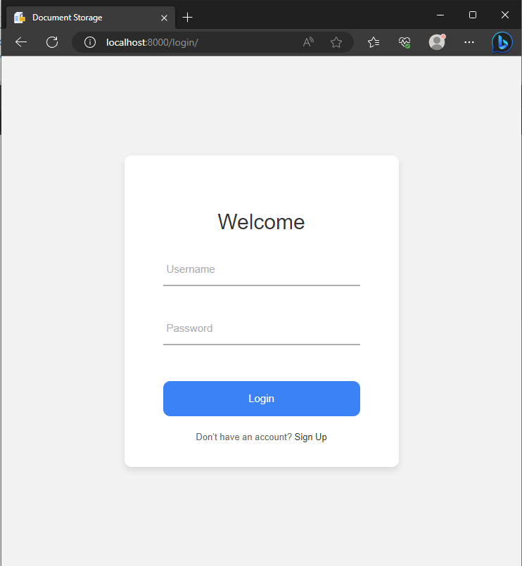
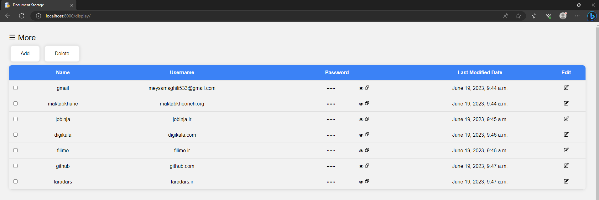

# Password Storage

A simple website to store passwords.

## Installation

1. Install `python3`
2. Clone the project using:  `git clone https://github.com/meysam-aghili/password_storage.git`.
3. Install required python libraries :
``` Command Prompt
pip install -r requirements.txt
```
4. Run `password storage` using : 
``` Command Prompt
cd src
python manage.py runserver
```
5. Go to [http://localhost:8000](http://localhost:8000) to see your website.





